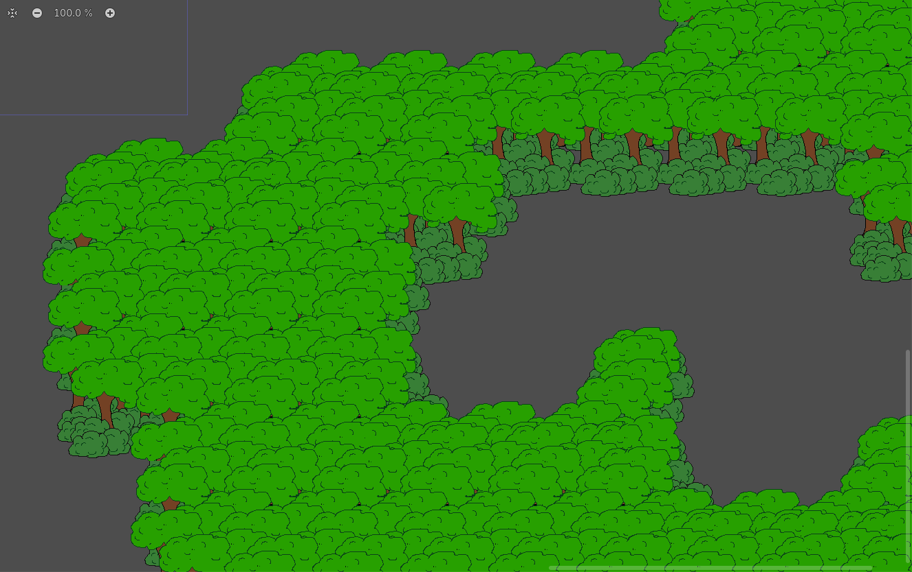

# Tileset Compositor for Godot

## Basic Instructions

Check sample scenes to get the idea or use as base. Use Godot editor for creating a scene, and ingame window (`F5`) for exporting image ('Space' or 'Enter' while in game view).

I have quickly doodled a sample tree and bush objects and have managed to create an auto-tiling tileset within an hour, you can see it in action by opening the scene `samples/sample-tileset.tscn`. The sprites don't look great, but I can make them nicer later and the graphics will update in all tiles, and that is the purpose of this tool - smart objects that update when their base texture gets modified.

## What Is It?

Tileset Compositor is a Godot 4 project that includes scenes, scripts, and samples. It is meant to be used from the editor, with occasinal running of the game in order to use the export function.

It allows you to compose an image using the equivalent of "smart objects", which is to say instanced sprites that will auto-update if you update the graphics of their base texture.

With the added benefit of being able to turn on Y-ordering for these sprites (they will be drawn in front of other sprites that are higher on Y axis) this becomes a useful tool for composing tilesets with large and complex tiles that are made of several graphical objects.

I am sure there could be more uses for it, but tileset image composition was my main inspiration. During work on a game that uses large 128px tiles composed out of many graphical elements such as trees, I ran into several issues during texture asset creation. 

1. I wanted to use small individual graphics (such as a single tree variant) to compose tile images. However, these objects are just copies and will not update if I later choose to alter the appearance of base image. This would make my image composing work useless and I would have to do a lot of clicking to replace copies with the updated image. I have not found a free raster graphic software which has a good workflow for this.

2. These same individual objects would sometimes overlap, so I had to sort them according to Y axis, which is quite a painful work if there are a lot of them and all you can do is drag a layer up or down. Automated Y-sorting is another feature I could not find in free raster graphic software.

I have decided that creating a Godot project with specific scripts and scene setups is the path of least resistence. I don't know if there are better ways but this project is allowing me to overcome the two issues mentioned above and create large funcional auto-tiling terrain tiles, and now I am sharing it with the world. Considering the wealth of features present in Godot editor, you should be able to expand functionalities of this setup in any direction you need.

## How Does It Work?

The basic idea is you will import your individual graphical objects as textures (sprites), turn them into reusable scene objects, compose a scene out of these objects (and any other element you need) and export the composition as transparent png.

### Initial Setup

#### Configure output image

Decide what the target image is, project's default is 1024x1024px. Open the `main` scene that is in `res` root and update the `RenderingViewport`: under its `SubViewport` options set x and y `size` to your desired export format.

#### Prepare the "canvas"

The `RenderingViewport` must be parent to all graphical elements that will appear in the exported image. Whatever the preview image is showing in its inspector view is what will be rendered. If something is not there but it should be then you have to figure it out.

To keep it clean I suggest you only use other scenes in there. The project starts with a `SampleTileset` scene, you should replace it with your own and then do all the graphical editing inside that scene. 

The `SampleTileset` scene is showing a suggested setup, with three layers of containers (background, foreground, sky) all having Y-sorting turned on (very important) and locked for editing. It also has a grid object that can be made visible.

1. Create a new scene that will do something similar and add a grid of appropriate cell size (if what you are making is a tileset), some pre-made grids are available in the project. Remember to make grid invisible if you are exporting the image.
2. Add the scene that you have just created as a child to the `RenderingViewport->Graphics` node in the `main` scene. From now on you should leave the `main` scene alone, unless you want to make some wide adjustment.

#### Importing graphics: proposed Workflow

The project only has sample graphics, you should import your own trees, rocks, buildings, people, whatever are the elements that you will use to compose the final image.

1. Export your individual objects from your graphic software as images and import them as sprite textures.
2. Decide how you will use them as objects - either just drag&drop images themselves (in which case they will still be objects as sprites and auto-update if you change the source texture) or turn them into scenes first, perhaps by duplicating one of the `base...` objects and replacing the sprite and offset. The scene approach is preferable as you should set your sprites offset so that its bottom part is where the wrapping node's center is, this will make automatic Y-sorting feel more natural.

#### Composing the scene: proposed workflow for tilesets

While the specifics of the scene creation are up to you, the following would be the recommended workflow for tileset creation.

1. Create a structure similar to the scene `sample-tileset-1024-128`. That one is made for tileset image of size 1024px with 128px cell size, has `Ordering->Y-Sorting Enabled` enabled for the Node2d that parents all layers, has three "layers" (parenting nodes) - Background (ground), Foreground (things on ground), and Sky (things above things on ground), is using a matching grid sprite, and has all parent nodes locked to prevent accidental moving. You will adjust all these according to your needs.
2. Start adding objects. This is the part that is a bit rough, in Godot you cannot just click-paint objects onto a single parent layer (or at least I don't know the way). You can drag&drop an object out of your library into the scene view and it should automatically become child of the currently selected node, but if you drag&drop again the next object will become child of the previous object which became automatically selected when you dropped it in, and you don't want that. The most reliable way to add objects quickly is to duplicate the ones that are already in the scene (right click in the hierarchy view and select `Duplicate`.
3. If you are doing tiles make sure they are seamless. This is hard work that requires good deal of brain power in order to keep in mind which tile should be seamless with which other tiles. This all depends on how your tileset will work. In the sample scene `sample-tileset-...` is a functional seamless terrain tileset that is able to auto-tile and supports inner and outer corners. Making tiles seamless involves making sure that each object which crosses a left-or-right side must have a duplicate on X axis, and each object that crosses a top-or-bottom side must have a duplicate on Y axis, meaning that each object which crosses both vertical and horizontal sides must have four instances in total, one pair for each axis. And this must be done with pixel perfection. It sounds like very hard work but I have managed to create the sample tileset within an hour by starting with the middle one that has connections to all 8 directions and mostly copy-pasting the rest. The limitation of the sample auto-tiling terrain is that a line of tiles must be at least 2 tiles wide. You may apply a more advanced system, this is just what I was happy with. The resulting auto-tiling terrain can be seen in its test map `sample-tilemap.tscn`, you may try painting the tiles yourself.
4. Making auto-tiling tile variations in the described way ends up occupying a lot of space, in case of the sample tileset the group of trees at the bottom half serve only to create four inner corner tiles, while all the surrounding tiles are just occupying the space that won't be used in the tileset, they only serve to create illusion of looping. This is why you might want to export the result (F5 to run the game and press `space` or `enter` to export image) and then cut out the squares that you will actually use and move them into a new file that can use the space in a more optimal way.

#### Exporting the PNG image

The project is configured so that the `RenderingViewport` in the `main` scene decides what goes into the image and its dimensions.

To export the image press `F5` to run the "game" and then press `Enter` or `Space` key. Check logs to see the image file's location (this will be improved). Ignore what you see with in-game camera, it is the viewport that will get rendered. There was an idea to use in-game camera as a walkable 1:1 preview of the image but I am a new Godot user and was unable to make it work (and it is not really a crucial feature).

Now that you have the image you can use it as source for Godot's tileset or modify the image further in other software to make it prettier or to optimize for spritesheet space.
